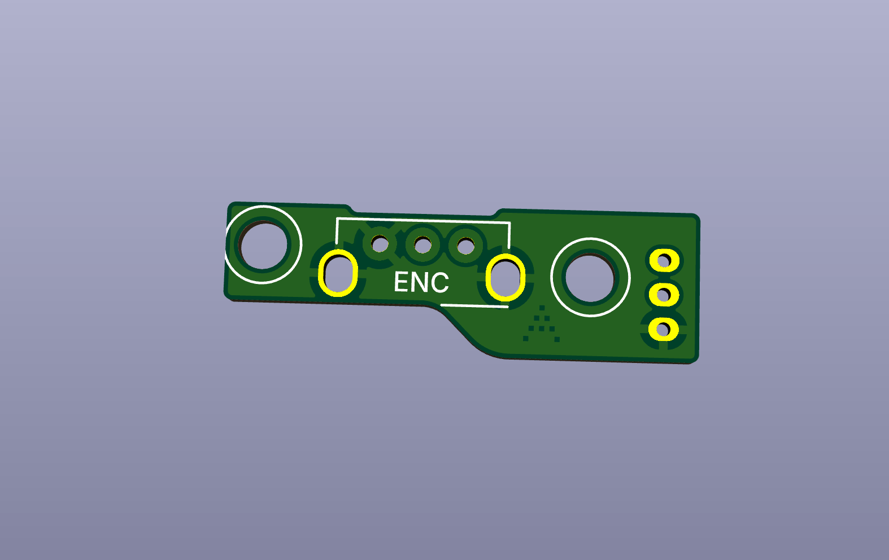
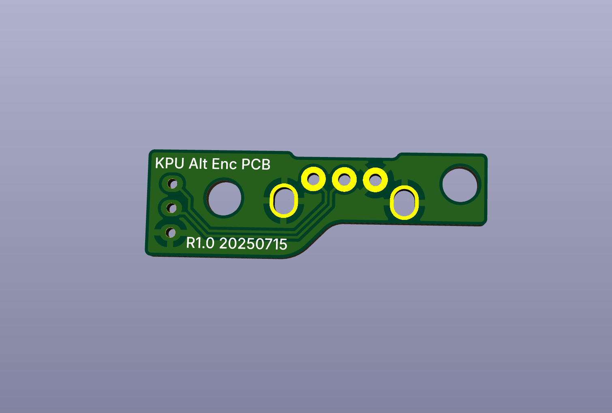

# KPU-Encoder-PCB
Replacement scroll wheel encoder PCB for the Kone Pure Ultra mouse

**Warning: Currently untested.**

Designed to be a drop-in replacement for the stock encoder PCB in the KPU mouse to simplify repairs and upgrades.  
Order in 1.2mm thickness to match the stock configuration.  

Solder a 9mm tall mouse wheel encoder onto the PCB, making sure that the encoder is on the correct side with its body above the rectangular area marked `ENC`.  
